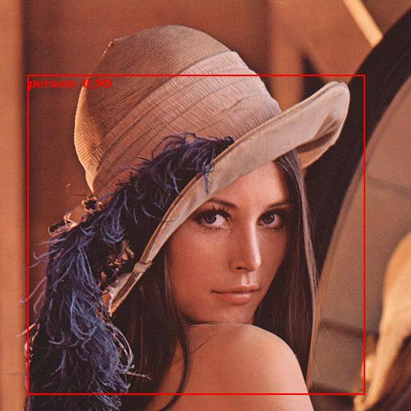

## Object detection in torch

This library aims to provide a simple architecture to easily perform object detection in [torch](http://torch.ch).
It currently contains code for training the following frameworks: [RCNN](http://arxiv.org/abs/1311.2524), [SPP](http://arxiv.org/abs/1406.4729) and [Fast-RCNN](http://arxiv.org/abs/1504.08083).

It consists of 7 basic classes:

* ImageTransformer: Preprocess an image before feeding it to the network
* DataSetDetection: Generic dataset class for object detection.
  * DataSetPascal
  * DataSetCOCO (not finished)
* [FeatureProvider](#feat_provider): Implements the necessary operations on images and bounding boxes
  * [RCNN](#rcnn)
  * [SPP](#spp)
  * [Fast-RCNN](#frcnn)
* [BatchProvider](#batch_provider): Samples random patches
  * [BatchProviderRC](#batch_provider_rc): ROI-Centric
  * [BatchProviderIC](#batch_provider_ic): Image-Centric
* ImageDetect: Encapsulates a model and a feature provider to perform the detection
* Trainer: Simple class to perform the model training.
* Tester: Evaluate the detection using Pascal VOC approach.

<a name="feat_provider"></a>
### Feature Provider
The `FeatureProvider` class defines the way different algorithms process an image and a set of bounding boxes to feed it to the CNN.
It implements a `getFeature(image, boxes [,flip])` function, which computes the necessary transformations in the input data (the optional `flip` argument horizontaly flips the image and the bounding box correspondingly), a `postProcess()`, which takes the output of the network plus the original inputs and post-process them. This post-processing could be a bounding box regression step, for example.
Every Feature Provider constructor take as input a `ImageTransformer`, and a `max_batch_size` (used for evaluation).

<a name="rcnn"></a>
#### RCNN
This is the first work that used CNNs for object detection using bounding box proposals.
The transformation is the simplest one. It crops the image at the specified positions given by the bounding boxes, and rescale them to be square.
The constructor has the following arguments:
  * `crop_size`
  * `padding`
  * `use_square`
  * `num_threads` number of parallel threads

<a name="spp"></a>
#### SPP
Contrary to RCNN, SPP crops the images in the feature space (here, `conv5`). It allows to compute the convolutional features once for the entire image, making it much more efficient.
The constructor has the following arguments:
  * `model`
  * `pooling_scales`
  * `num_feat_chns`
  * `scales`: image scales
  * `sz_conv_standard`
  * `step_standard`
  * `offset0`
  * `offset`
  * `inputArea`
  * `use_cache`
  * `cache_dir`

SPP allows faster training/testing by caching the convolutional feature maps. You can provide to `getFeature` instead of an image `I` an image index `i` (from a `DataSetDetection` object), which will load the corresponding feature map from disk (if already computed and if `use_cache` is set to `true`). To easily cache all features of a dataset in disk, use the method `:saveConvCache()`.

<a name="frcnn"></a>
#### Fast-RCNN
Similar to SPP, Fast-RCNN also crops the images in the feature space, but instead of keeping the convolutional layers fixed, they allow it to train together with the fully-connected layers.
The constructor has the following arguments:
  * `scale`
  * `max_size`
  * `inputArea`

The output of `getFeature()` is a table with two entries, the preprocessed image/images as the first element, and the projected bounding boxes. An example of a CNN model structure which can be used with Fast-RCNN is as follows:
```lua
-- define features and classifier as you wish.
-- Can use loadcaffe to read from a saved model, for example
features   = torch.load('alexnet_features.t7')
classifier = torch.load('alexnet_classifier.t7')

-- define the ROIPooling layer
-- can use either inn.ROIPooling or nnf.ROIPooling (with CPU support)
-- let's just use standard parameters from Fast-RCNN paper
local ROIPooling = inn.ROIPooling(6,6):setSpatialScale(1/16)

-- create parallel model which takes as input the images and
-- bounding boxes, and pass the images through the convolutional
-- features and simply copy the bounding boxes
local prl = nn.ParallelTable()
prl:add(features)
prl:add(nn.Identity())

-- this is the final model
model = nn.Sequential()
model:add(prl)
model:add(ROIPooling)
model:add(nn.View(-1):setNumInputDims(3))
model:add(classifier)
```

<a name="batch_provider"></a>
### Batch Provider
This class implements sampling strategies for training Object Detectors.
In its constructor, it takes as argument a `DataSetDetection`, and a `FeatureProvider`.
It implements a `getBatch` function, which samples from the `DataSet` using `FeatureProvider`.
The following arguments are present for all derived classes:
  * `DataSetDetection`
  * `FeatureProvider`
  * `batch_size`
  * `fg_fraction`
  * `fg_threshold`
  * `bg_threshold`
  * `do_flip`

<a name="batch_provider_rc"></a>
#### BatchProviderRC
ROI-Centric Batch Provider, it samples the patches randomly over all the pool of patches.
To minimize the number of disk access, it reads the data for a specified number of batches and store it in memory.
The constructor take the following optional arguments:
  * `iter_per_batch`
  * `nTimesMoreData`

<a name="batch_provider_ic"></a>
#### BatchProviderIC
Image-Centric Batch Provider, it first samples a set of images, and then a set of patches is sampled on those sampled images.
The constructor take the following optional arguments:
  * `imgs_per_batch`

### Examples
Here we show a simple example demonstrating how to perform object detection given an image and a set of bounding boxes.
Run it using `qlua` for the visualization part. A pre-trained model for Fast-RCNN can be found [here](https://drive.google.com/file/d/0B-TTdm1WNtyba3I4Vm1hbFRSS2c/view?usp=sharing).
```lua
require 'nnf'
require 'image'
require 'cudnn'
require 'inn'
require 'nn'

-- load pre-trained Fast-RCNN model
params = torch.load('cachedir/frcnn_alexnet.t7')
loadModel = dofile 'models/frcnn_alexnet.lua'
model = loadModel(params)

model:add(nn.SoftMax())

model:evaluate()
model:cuda()

-- prepare detector
image_transformer= nnf.ImageTransformer{mean_pix={102.9801,115.9465,122.7717},
                                        raw_scale = 255,
                                        swap = {3,2,1}}
feat_provider = nnf.FRCNN{image_transformer=image_transformer}
feat_provider:evaluate() -- testing mode

detector = nnf.ImageDetect(model, feat_provider)

-- Load an image
I = image.lena()
-- generate some random bounding boxes
torch.manualSeed(500) -- fix seed for reproducibility
bboxes = torch.Tensor(100,4)
bboxes:select(2,1):random(1,I:size(3)/2)
bboxes:select(2,2):random(1,I:size(2)/2)
bboxes:select(2,3):random(I:size(3)/2+1,I:size(3))
bboxes:select(2,4):random(I:size(2)/2+1,I:size(2))

-- detect !
scores, bboxes = detector:detect(I, bboxes)

-- visualization
dofile 'visualize_detections.lua'
threshold = 0.5
-- classes from Pascal used for training the model
cls = {'aeroplane','bicycle','bird','boat','bottle','bus','car',
  'cat','chair','cow','diningtable','dog','horse','motorbike',
  'person','pottedplant','sheep','sofa','train','tvmonitor'}

w = visualize_detections(I,bboxes,scores,threshold,cls)

```
This outputs the following




For an illustration on how to use this code to train a detector, or to evaluate it on Pascal, see the [examples](http://github.com/fmassa/object-detection.torch/tree/refactoring/examples).

#### Bounding box proposals
Note that this repo doesn't contain code for generating bounding box proposals. For the moment, they are pre-computed and loaded at run time.

#### Model definition
All the detection framework implemented here supposes that you already have a pre-trained classification network (trained for example on ImageNet). They reuse this pre-trained network as an initialization for the subsequent fine-tuning.

In `models/` you will find the model definition for several classic networks used in object detection.

The zeiler pretrained model is available at [https://drive.google.com/open?id=0B-TTdm1WNtybdzdMUHhLc05PSE0&authuser=0](https://drive.google.com/open?id=0B-TTdm1WNtybdzdMUHhLc05PSE0&authuser=0).
It is supposed to be at `data/models`
If you want to use your own model in SPP framework, make sure that it follows the pattern
```
model = nn.Sequential()
model:add(features)
model:add(pooling_layer)
model:add(classifier)
```
where `features` can be a `nn.Sequential` of several convolutions and `pooling_layer` is the last pooling with reshaping of the data to feed it to the classifer. See `models/zeiler.lua` for an example.

### Dependencies

It requires the following packages

 - [xml](http://doc.lubyk.org/xml.html) (For `DataSetPascal`)
 - [matio-ffi.torch](https://github.com/soumith/matio-ffi.torch) (For `DataSetPascal`)
 - [hdf5](https://github.com/deepmind/torch-hdf5) (for `SPP`)
 - [inn](https://github.com/szagoruyko/imagine-nn) (for `SPP`)

To install them all, do

```
## xml
luarocks install xml

## matio
# OSX
brew install libmatio
# Ubuntu
sudo apt-get install libmatio2

luarocks install matio
```

To install `hdf5`, follow the instructions in [here](https://github.com/deepmind/torch-hdf5/blob/master/doc/usage.md)

### Old code
The old version of this repo can be found [here](https://github.com/fmassa/object-detection.torch/tree/legacy).


### Running this code

First, clone this repo
```
git clone https://github.com/fmassa/object-detection.torch.git
```

The default is to consider that the dataset is present in `datasets/VOCdevkit/VOC2007/`.
The default location of bounding boxes `.mat` files (in RCNN format) is supposed to be in `data/selective_search_data/`.
